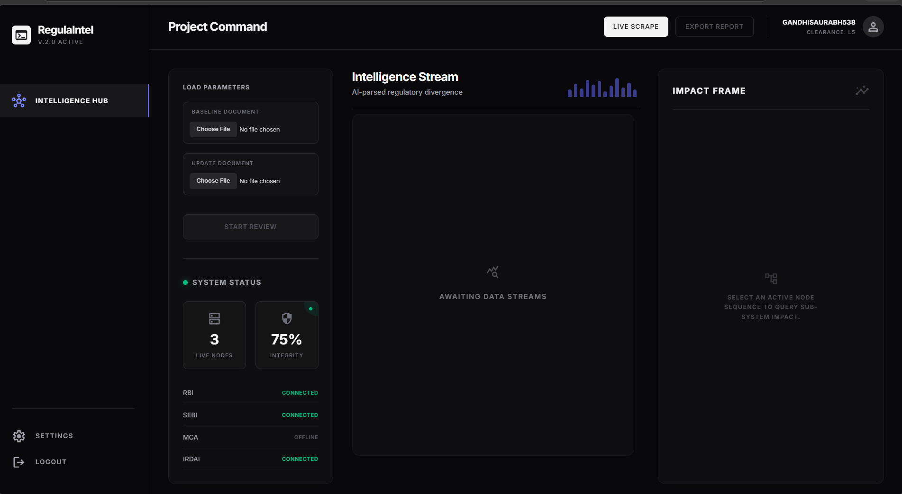
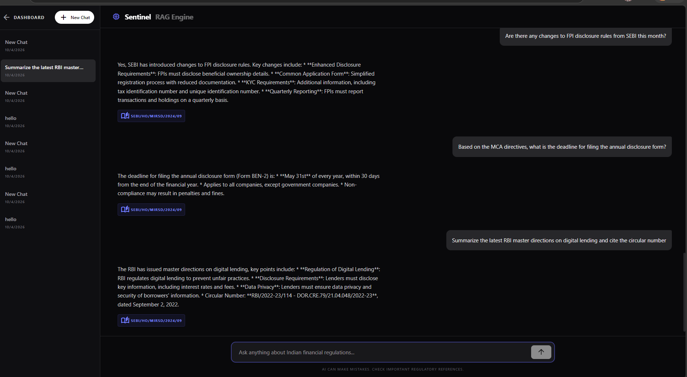
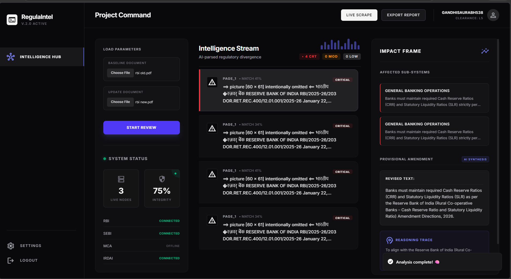

<div align="center">
  <h3>🏆 Built for SUNHACKS Hackathon 2k26</h3>
  <h4>🚀 Team: TEAM ACCIO | ID: 28012068</h4>
  <p>
    
    
    
    
    
    
    
  </p>
</div>

# RegulaIntel - Autonomous AI Sentinel for Financial Compliance

A comprehensive autonomous web application for live regulatory compliance tracking, version differential scanning, and expert AI-driven policy insights.


## 📊 Project Presentation

<div align="center">
  <a href="assets/ppt.pdf" target="_blank">
    
  </a>
</div>

> 🖥️ **[Click here to open the full project presentation (PDF)](assets/ppt.pdf)** — opens in a new tab.

---

## 📸 Core Features Gallery
To keep it clean and high-impact for the judges, we recommend these three essential screenshots:
1. **The Intelligence Hub**: 
2. **Sentinel RAG Session**: 
3. **Divergence Report**: 


## ✨ Key Features

### 1. 🧠 Sentinel RAG Engine (Smart Chat)
An integrated ChatGPT-style interface with localized session memory. Unlike standard LLMs, it loads the last 6 messages of context from SQLite and provides **active citation tags** mapping back to the exact regulatory section used for the answer.

### 2. ⏳ Lifecycle Timeline (Circular Versioning)
Automatically tracks every update to a regulation. When a new circular is released (e.g., *KYC Master Direction*), the system archives the previous state as `v1` and logs the new one as `v2` within a unified historical timeline.

### 3. 🔍 AI Differential Scanner (Version Compare)
A high-stakes comparison tool. Selecting any two immutably logged versions triggers a recursive LangGraph agentic scan to detect semantic shifts, compliance risks, and critical anomalies between the archives.

### 4. 📡 Autonomous Node Monitoring
Continuous real-time sweeping of regulators (RBI, SEBI, MCA, IRDAI). The system dynamically calculates integrity status based on active scraper connectivity.

### 5. 💎 Vercel-Grade UI/UX
A premium, minimalist glassmorphism interface built with Framer Motion. Smooth micro-animations, responsive data charts, and a consistent 95% dark theme identity.

### Supported Regulatory Databases (4 Classes)
| Node | Databases Tracked |
|-------|----------|
| **RBI** | Master Directions, Circulars, Monetary Policy Docs, KYC |
| **SEBI** | Depository Participant Rules, Market Infrastructure Mandates |
| **MCA** | Corporate Disclosures, LLP Directives |
| **IRDAI** | Insurance Rules, Underwriting Mandates |

---

## 🧭 Navigation & Interactive Routes

### 🏠 Command Center (`/`)
The primary hub showing real-time **Regulatory Node Integrity**. Monitor the live status of fetchers and view the overall system health chart.
<sub>Access at: [http://localhost:5173/](http://localhost:5173/)</sub>

### 🧠 Sentinel RAG Chat (`/chat`)
Engage with a context-aware AI expert. Supports **Persistent Session History** and provides direct **Circular Reference Tags** for every answer derived from the regulatory database.
<sub>Access at: [http://localhost:5173/chat](http://localhost:5173/chat)</sub>

### 📜 Historical Vault (`/history`)
Your regulatory time-machine. View a **Vertical Timeline** of all archived circular versions. Select any two versions to run the **AI Differential Scanner** for a recursive compliance impact report.
<sub>Access at: [http://localhost:5173/history](http://localhost:5173/history)</sub>

### 🔑 Secure Gate (`/login`)
A fully redesigned, minimalist authentication flow powered by Supabase.
<sub>Access at: [http://localhost:5173/login](http://localhost:5173/login)</sub>

> [!IMPORTANT]
> **Email Verification Required:** Upon registering, Supabase will send a confirmation link to your email. You **must** verify the link before the Sentintel Dashboard will allow access.


---


## Quick Start

### 1. Install Dependencies

```bash
pip install -r requirements.txt
cd frontend
npm install
cd ..
```

### 2. Configure Environment

Edit `.env` files in both root and frontend folders:

**Backend (`/Sunhack_Hackathon/.env`)**
```env
# Groq LLM Runtime
GROQ_API_KEY=your-groq-api-key-here
```

**Frontend (`/Sunhack_Hackathon/frontend/.env`)**
```env
# Supabase Configuration
VITE_SUPABASE_URL=your_supabase_project_url_here
VITE_SUPABASE_ANON_KEY=your_supabase_anon_key_here
```

### 3. Initialize Databases

```bash
# Initializes SQLite (Sessions & Versions) and ChromaDB
python db/database.py
```

### 4. Start Application

**Backend API:**
```bash
python api.py
```

**Frontend React App:**
```bash
cd frontend
npm run dev
```

Access at: **http://localhost:5173**


## Test Credentials

**Authentication is controlled via Supabase:**
- Register any active email account and utilize the magic-link/password verification generated.


## Project Structure

```
REGULA_INTEL/
├── agents/                        # AI & Scraper Pipelines
│   ├── diff.py                    # AI semantic differ
│   ├── executor.py                # Action executor
│   ├── impact.py                  # Policy impact analyzer
│   ├── ingest.py                  # Live Document injest/tagger
│   ├── monitor.py                 # RBI/SEBI/MCA/IRDAI Web crawlers
│   └── workflow.py                # LangGraph state machine routers
├── data/                          # Databases
│   ├── regulaintel.db             # Local SQLite Session/circular tracking
│   └── chroma_db/                 # Chroma vector collections
├── db/                            # Database Initialization
│   └── database.py                # Table schemas
├── frontend/                      # React User Interface
│   ├── src/
│   │   ├── components/            # Isolated view components
│   │   ├── contexts/              # Auth wrappers
│   │   ├── pages/
│   │   │   ├── Dashboard.jsx      # Main glassmorphic hub
│   │   │   ├── Chat.jsx           # RAG Engine memory-chat
│   │   │   └── History.jsx        # Timeline Differential view
│   │   ├── App.jsx                # Router & Protected Guards
│   │   └── index.css              # Dark theme base tailwind layer
├── utils/                         # OCR & Utility Functions
│   └── pdf_processor.py           # Markdown/Page extractors
├── api.py                         # FastAPI Router (Endpoints)
├── requirements.txt               # Python Dependencies
└── README.md                      # This File
```


## Engine Performance

### Scraping Capability Results
- **Sources Tracked:** RBI, SEBI, IRDAI, MCA
- **Fetch Frequency:** Automated looping runtime logic
- **Database Backup:** Local SQLite persistence with live Chroma metadata chunking

### Execution Metrics
- **RAG Retrieval Depth:** LangChain retrieves last 6 chat history messages locally context-windowed.
- **Node Integration Status:** Calculated Dynamically `(live nodes / total nodes) * 100`.
- **System Theme:** #09090b primary root with Indigo-500 highlighting.


## Configuration

### Environment Setup

The backend utilizes `Groq` for high-throughput language generation without heavy local GPU reliance.

Generate a free Groq API key here: https://console.groq.com/keys


## Documentation

| Document | Description |
|----------|-------------|
| `README.md` | This file - main documentation |
| `task.md` | Autonomous internal breakdown tracker |
| `implementation_plan.md` | Structural overview of logic changes |
| `walkthrough.md` | Visual validation proofs |


## Development

### Run Live Scrapers Separately

```bash
python agents/monitor.py
```

### View Live LLM Graphs

LangGraph agents are configured sequentially. Entry begins at `agents.ingest`, routes to `agents.diff`, evaluates in `agents.impact`.


## Security Features

- **Supabase Vault** - RLS protected authentication guards natively built-in
- **Isolated Databases** - SQLite and Vector storage operates purely behind FastAPI local bounds
- **Sanitized Routing** - React ProtectedRoutes bound all user interactions
- **Fallback Mocks** - Automatically catches missing LLM keys to prevent demonstration crashes


## Relational Schema

### SQLite `messages` Collection
```sql
CREATE TABLE messages (
    id INTEGER PRIMARY KEY AUTOINCREMENT,
    session_id TEXT,
    role TEXT,
    content TEXT,
    timestamp TIMESTAMP DEFAULT CURRENT_TIMESTAMP,
    circular_refs TEXT
)
```

### SQLite `circular_versions` Collection
```sql
CREATE TABLE circular_versions (
    circular_id TEXT,
    source TEXT,
    version_number INTEGER,
    ingested_at TIMESTAMP DEFAULT CURRENT_TIMESTAMP,
    file_path TEXT,
    chunk_ids TEXT
)
```


## Troubleshooting

### Node Fetching Failed (0% Integrity)
Check internet connection to Indian Regulatory nodes. Certain endpoints may geo-block based on host server.

### Chat Engine states 'Offline'
Provide your valid Groq API key manually into `d:\Sunhack_Hackathon\.env`. Verify standard format `GROQ_API_KEY=gsk_...`


## Support

For issues or questions:
1. Verify `ChromaDB` directories possess active read/write permissions.
2. Confirm Vite frontend executes properly on Node v18+.


## Acknowledgments

- **Groq** - Blazing fast LLM inference engines (Llama-3.3 models)
- **Supabase** - Open Source Firebase alternative
- **LangChain & LangGraph** - Complex agent orchestration
- **Team Accio (28012068)** - Primary Development Team for SUNHACKS 2k26

<div align="center">
  <i>Developed for the SUNHACKS Hackathon 2k26. Redefining Compliance through Autonomous AI Intelligence.</i>
</div>
