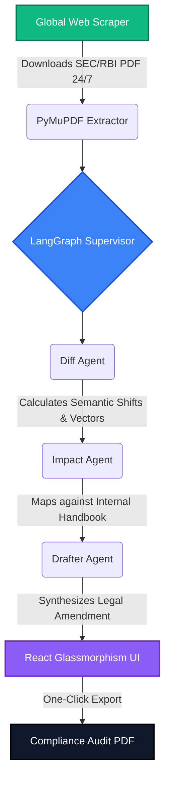

<div align="center">
  
  
  
  
</div>

<br/>

<div align="center">
  <h1 align="center">🏛️ RegulaIntel</h1>
  <strong>The Autonomous AI Compliance Officer & Legal Auditor</strong>
</div>

<br/>

<p align="center">
  RegulaIntel is a fully autonomous, Multi-Agent AI system designed to solve the manual bottleneck of legal compliance. It actively monitors government websites (RBI, SEBI, MCA), mathematically analyzes exactly what changed in new laws, cross-references these laws against internal company databases, and automatically drafts handbook amendments within 24 hours of dropping.
</p>

---

### 🌟 Why RegulaIntel? (The "So What?")
Traditional compliance teams take weeks to digest new financial circulars. Enter **RegulaIntel**:
- 🕷️ **Autonomous Crawling:** Zero-human-in-the-loop design. Built-in web scrapers intercept new PDFs from SEC/RBI pages automatically.
- 🧠 **Semantic Diffing:** Uses `SentenceTransformers` to detect precise semantic and legal shifts, not just basic text changes.
- 🔗 **Impact Mapping Engine:** Maps external laws directly to your specific *internal* master policies to determine infrastructural failure/impact.
- ⚡ **Auto-Drafter:** The integrated LLM instantly drafts the proposed amendment for your legal team to copy-paste.
- 🎨 **Glassmorphism React UI:** Enterprise-grade traceability dashboard built on modern web-design paradigms.

---

### 🛠️ Architecture Tech Stack
- **AI Core Intelligence:** LangChain, LangGraph (Multi-Agent Routing), `SentenceTransformers` (Semantic Search), Groq (LLM Inference)
- **Backend Infrastructure:** FastAPI, Python, PyMuPDF (Document Parsing), Web Scraping (`BeautifulSoup`, `feedparser`)
- **Frontend Presentation:** React, Vite, Framer-Motion (Micro-animations), TailwindCSS v4, Sonner (Toasts)
- **Local Data Storage:** Local Directory Arrays (Production maps to Pinecone/AWS S3)

---

### 📂 Repository Structure
```text
RegulaIntel/
│
├── agents/                  # Multi-Agent LangGraph intelligence
│   ├── diff.py              # Analyzes exact semantic shifts
│   ├── impact.py            # Maps shifts to internal policies
│   ├── drafter.py           # Auto-generates handbook amendments
│   └── workflow.py          # The LangGraph Supervisor configuration
│
├── api.py                   # FastAPI Application Server (Backend)
│
├── data/                    # Vector Mock Data
│   ├── circulars/           # Local demo PDFs
│   ├── incoming/            # Destination for active Web Scraper
│   └── internal/            # Company Master Policy DB files
│
├── frontend/                # React / Vite Dashboard (Tailwind + Framer)
│   ├── src/                 
│   │   ├── App.jsx          # Primary UI Interface & API Hooks
│   │   └── index.css        # Premium Glassmorphism & Blob Styles
│   └── package.json         
│
└── utils/                   # Shared Infrastructure
    ├── scraper.py           # Chron-based BeautifulSoup logic
    ├── pdf_processor.py     # Binary PDF extraction algorithms
    └── report_generator.py  # FPDF Compliance Audit PDF Exporter
```

---

### 📊 Autonomous System Flowchart


---

### 🚀 Quick Start / Local Deployment

#### 1. Setup the AI Backend
```bash
# Clone the repository
git clone https://github.com/your-username/RegulaIntel.git
cd RegulaIntel

# Create and activate virtual environment (optional)
python -m venv venv
source venv/Scripts/activate

# Install dependencies
pip install -r requirements.txt

# Start the Multi-Agent FastAPI Server
python api.py
```

#### 2. Start the React UI (In a new terminal)
```bash
cd frontend
npm install
npm run dev
```

Finally, open your browser to `http://localhost:5173/` and hit the **AUTO-ANALYZE INTERCEPT** button!

---

### 📸 Demo Features
- **Live Scraper Trigger:** Watch the application scrape the web and download dummy PDFs locally without manual input.
- **Traceability View:** Every semantic match guarantees the exact page number and confidence score to eliminate AI hallucination.
- **Export to Compliance Audit:** Generate a professional PDF audit of the AI's findings in one click.

---

> Built intelligently for Sunhack Hackathon 2026.
